# 📋 LISTNOW

*LISTNOW* is a mobile application developed with Flutter and Firebase, allowing users to create, manage, and share lists. The app includes advanced features such as barcode scanning, product search, and real-time collaboration.

---

## 🚀 Features

- ✅ Create, delete, and edit lists  
- 📦 Add, remove, and update items within a list  
- 📷 Add products with barcode  
- 🔍 Search products by scanning barcodes  
- 👤 User registration and authentication  
- 👥 Follow and view other users’ lists  
- ☁ Cloud-based real-time database using Firebase Firestore  
- 🔄 Instant synchronization across devices  

---

## 🖼 Images

<table>
  <tr>
    <td>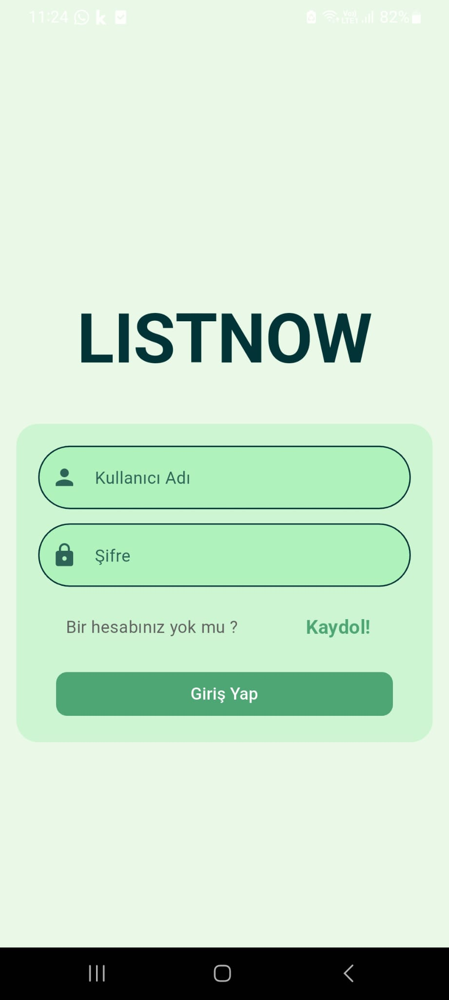</td>
    <td>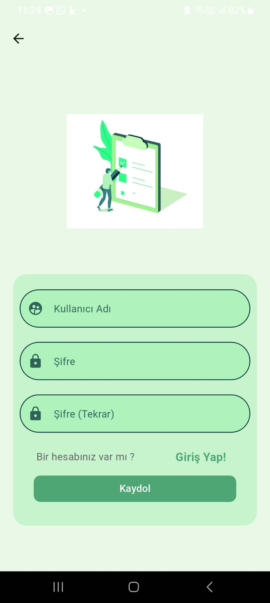</td>
    <td>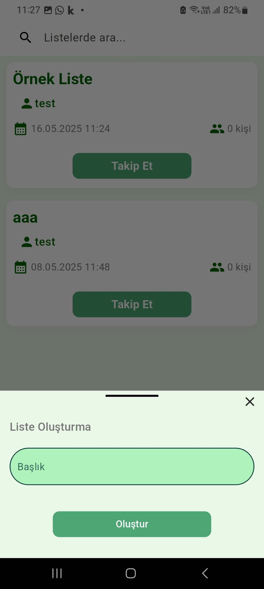</td>
  </tr>
  <tr>
    <td>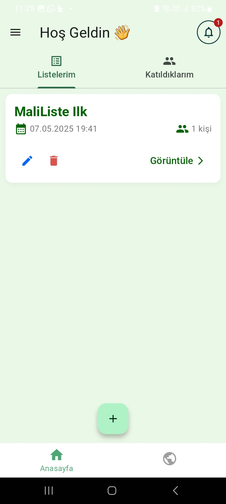</td>
    <td>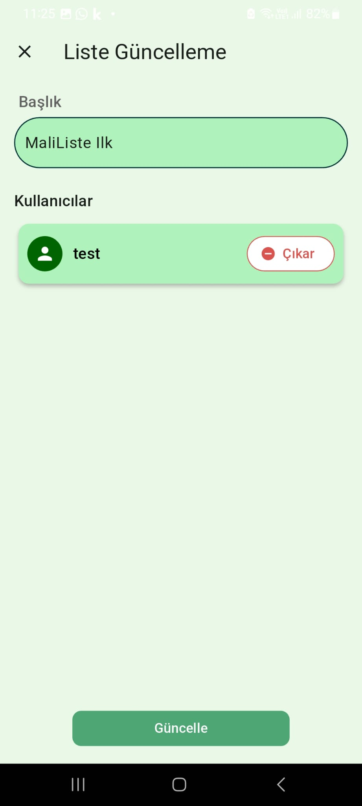</td>
    <td>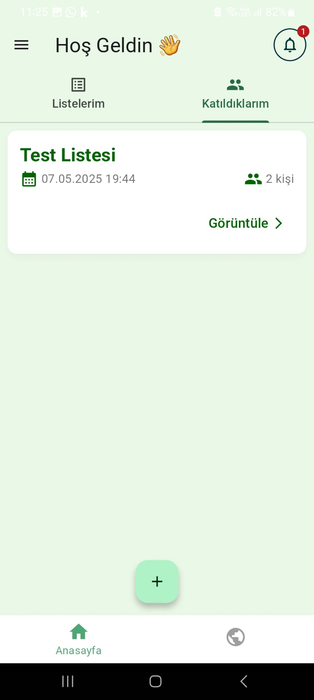</td>
  </tr>
  <tr>
    <td>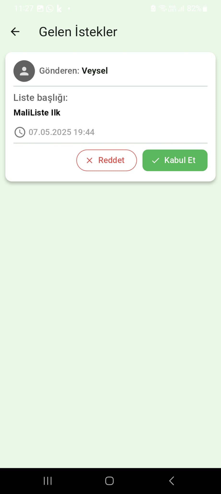</td>
    <td>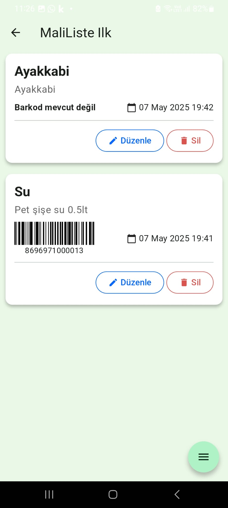</td>
    <td>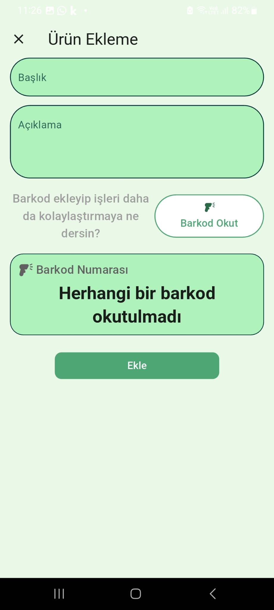</td>
  </tr>
  <tr>
    <td>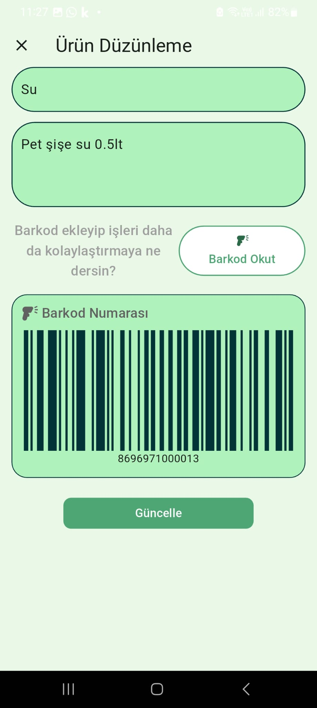</td>
    <td>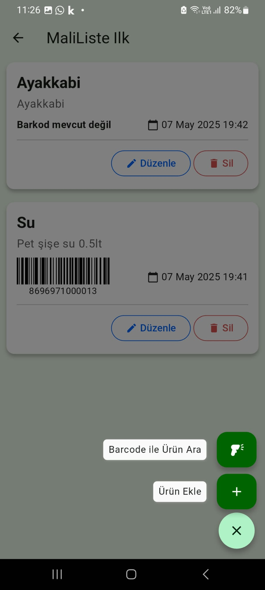</td>
    <td>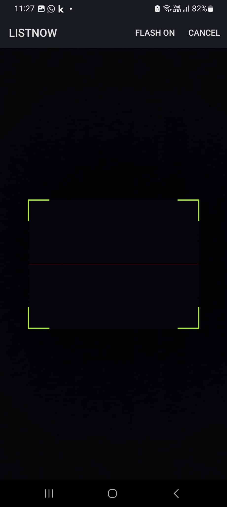</td>
  </tr>
  <tr>
    <td>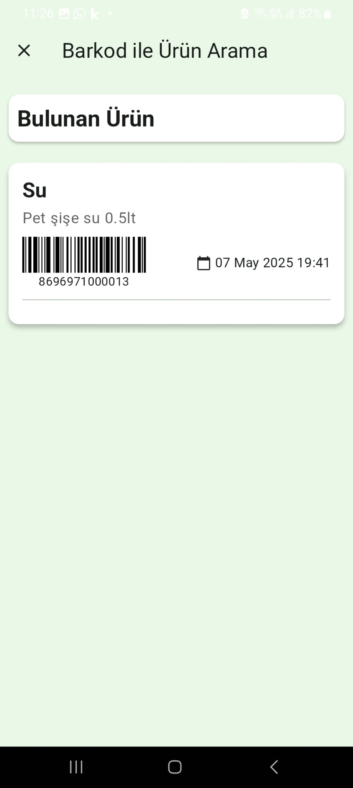</td>
    <td>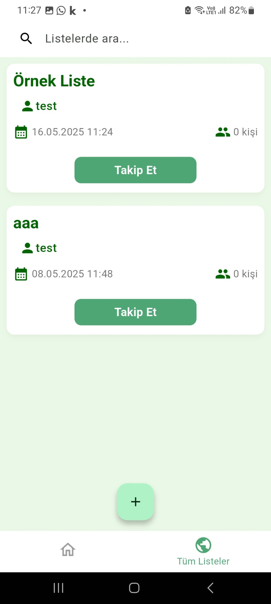</td>
    <td></td>
  </tr>
</table>

## 📬 Contact

Made with ❤ by [Veysel UĞURLU](https://github.com/Veyselugurlu) and [Mehmet Ali SİVRİ](https://github.com/MehmetAliSivriDev) 
Feel free to open an issue or reach out if you have feedback or questions!
